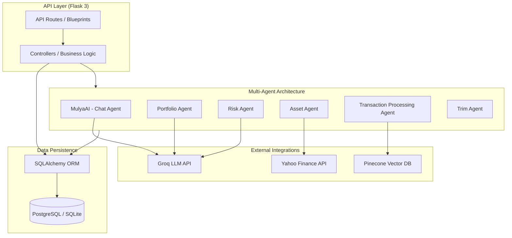

# Backend Architecture Diagram

This diagram illustrates the multi-agent architecture and data flow of the Finmate Flask backend.

## Technologies Used
- **Framework**: Flask 3
- **ORM**: SQLAlchemy
- **Database**: PostgreSQL (Production) / SQLite (Development)
- **AI Inference**: Groq API
- **Vector Search**: Pinecone
- **External Data**: Yahoo Finance
