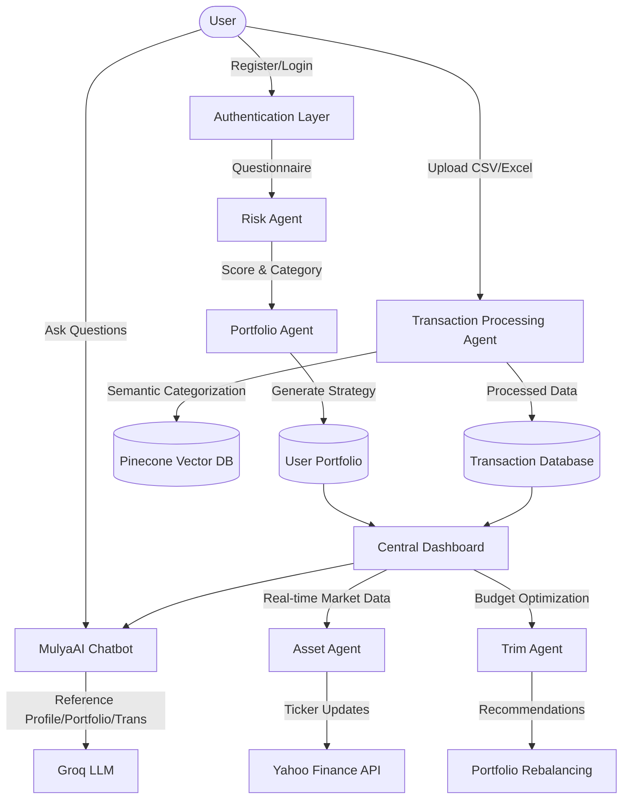

# Finmate Flow Diagram V2

This diagram illustrates the complete end-to-end user journey and data flow within the Finmate platform, as per the latest implementation.

## Journey Highlights
1. **Risk Discovery**: The journey begins with a psychological risk assessment.
2. **Automated Strategy**: A personalized portfolio is generated immediately after assessment.
3. **Smart Categorization**: Transactions are processed using Vector Embeddings for high accuracy.
4. **Intelligent Assistant**: MulyaAI provides a RAG-like experience by combining LLM power with user-specific financial data.
5. **Continuous Optimization**: The Asset and Trim agents ensure the user's financial health is constantly monitored and optimized.
