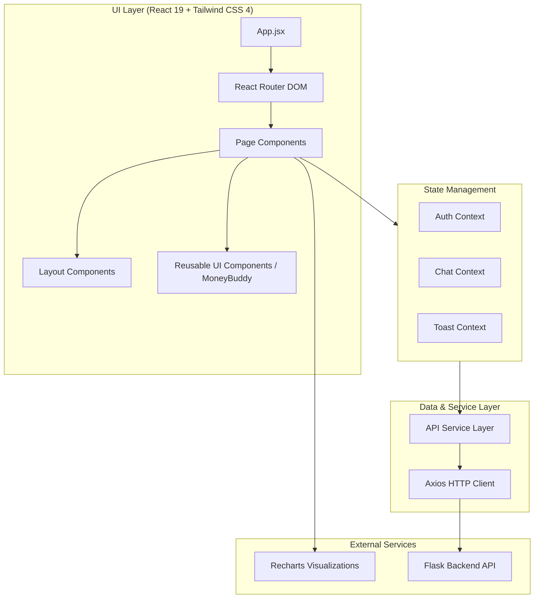

# Frontend Architecture Diagram

This diagram illustrates the high-level architecture of the Finmate React frontend.

## Technologies Used
- **Framework**: React 19
- **Build Tool**: Vite
- **Styling**: Tailwind CSS 4
- **Visualization**: Recharts
- **Routing**: React Router DOM
- **HTTP Client**: Axios
